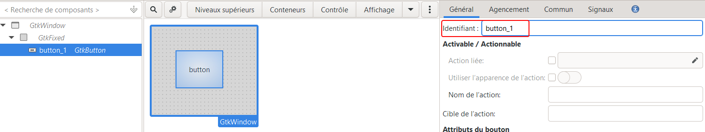

# TP GTK

Rédigé par **Noé LARRIEU-LACOSTE** ❤️

<!-- toc -->

- [Présentation](#presentation)
- [Pré-requis](#pre-requis)
  * [Installer MinGW, MSYS2 ou WSL (Pour windows)](#installer-mingw-msys2-ou-wsl-pour-windows)
  * [MSYS2, installation GTK et Glade](#msys2-installation-gtk-et-glade)
  * [WSL / Linux, Installation GTK et Glade](#wsl--linux-installation-gtk-et-glade)
    + [WSL, lancer une application graphique](#wsl-lancer-une-application-graphique)
- [1. Configuration CMAKE](#1-configuration-cmake)
- [2. Glade, premier programme](#2-glade-premier-programme)
  * [A. Keskecé ?](#a-keskece-)
  * [B. Charger un fichier glade en C](#b-charger-un-fichier-glade-en-c)
    + [Explications](#explications)
- [3. Connecter les widgets au code](#3-connecter-les-widgets-au-code)
- [4. Gérer les signaux / évènements](#4-gerer-les-signaux--evenements)
  * [A. Connecter les signaux](#a-connecter-les-signaux)
  * [B. Déclarer les méthodes pour les signaux](#b-declarer-les-methodes-pour-les-signaux)
  * [C. Spécificité Windows](#c-specificite-windows)
  * [D. Spécificité Linux (et Mac ?)](#d-specificite-linux-et-mac-)
- [5. Documentation GTK](#5-documentation-gtk)
- [Runtime (pour distribuer votre application)](#runtime-pour-distribuer-votre-application)
  * [Windows](#windows)
  * [Linux](#linux)
- [Sources](#sources)

<!-- tocstop -->

# Présentation

Nous allons voir comment développer une application GTK en C à l'aide de CMake, que ce soit sur Linux, et même Windows (avec MinGW, MSYS2 et même WSL !

**GTK** (The **G**IMP **T**ool**k**it, anciennement **GTK+**) est un ensemble de bibliothèques logicielles, c'est-à-dire un ensemble de fonctions permettant de réaliser des interfaces graphiques. Cette bibliothèque a été développée originellement pour les besoins du logiciel de traitement d'images GIMP. GTK+ est maintenant utilisé dans de nombreux projets, dont les environnements de bureau GNOME, Xfce, Lxde et ROX.

GTK est un projet libre (licence GNU LGPL 2.1) et multi plate-forme.

# Pré-requis

## Installer MinGW, MSYS2 ou WSL (Pour windows)

[Clion steps](https://www.notion.so/Clion-steps-b6178a704896452c83e48d8e03999ca6)

## MSYS2, installation GTK et Glade

> :warning: Bien vérifier que MSYS est installé à la racine d'un disque et avec un chemin sans caractères spéciaux ni espaces !!!

```cmd
E:\msys64\mingw64\bin
```

---

[The GTK Project - A free and open-source cross-platform widget toolkit](https://www.gtk.org/docs/installations/windows/)

Installer GTK3 et ses dépendances depuis la console MSYS2

```bash
pacman -S mingw-w64-x86_64-gtk3
```

Installer Glade, c'est ce qui va nous permettre de créer une interface GTK !
Comme pour GTK, il faut l'installer grâce à la console MSYS2

```bash
pacman -S mingw-w64-x86_64-glade
```

Installer base-devel si nécessaire, qui va nous permettre de lier les librairies GTK au projet grâce au module PkgConfig

```bash
pacman -S base-devel
```

## WSL / Linux, Installation GTK et Glade

Installer le package de développement pour gtk3 et glade :

```bash
apt install libgtk-3-dev glade
```

### WSL, lancer une application graphique

Nous n'avons pas besoin d'avoir un environnement graphique complet pour notre WSL (un bureau et tout), juste de pouvoir lancer des applications et afficher la fenêtre sur notre Windows.

Pour cela, nous allons utiliser la méthode consistant à faire tourner un "**X server**" sur Windows, ce qui va permettre à notre linux de s'y connecter comme à un écran et d'afficher ses applications graphiques.

L'outils que nous allons prendre (il en existe plusieurs) s'appelle [VcXsrv](https://sourceforge.net/projects/vcxsrv/)

[Running WSL GUI Apps on Windows 10](https://techcommunity.microsoft.com/t5/windows-dev-appconsult/running-wsl-gui-apps-on-windows-10/ba-p/1493242)

[How to run graphical Linux applications on Windows 10 using the Windows Subsystem for Linux (WSL)](https://seanthegeek.net/234/graphical-linux-applications-bash-ubuntu-windows/)

# 1. Configuration CMAKE

Pour faire fonctionner GTK correctement, il faut ajouter quelques instructions supplémentaires au `CMakeLists.txt`

```cmake
# Version minimum de cmake
cmake_minimum_required(VERSION 3.16)

# Nom et language du projet 
project(gtk_tp C)

set(CMAKE_C_STANDARD 99)

# On utilise le module PkgConfig pour détecter la librairie GTK+ sur le système
FIND_PACKAGE(PkgConfig REQUIRED)
PKG_CHECK_MODULES(GTK3 REQUIRED gtk+-3.0)

# On dit à CMake d'utiliser GTK+, on indique au compilateur où trouver les fichiers headers
# Et au linker où trouver les librairies
INCLUDE_DIRECTORIES(${GTK3_INCLUDE_DIRS})
LINK_DIRECTORIES(${GTK3_LIBRARY_DIRS})

# Instructions pour le compilateur
ADD_DEFINITIONS(${GTK3_CFLAGS_OTHER})

#Pour linux, va servir à correctement liers les signaux de notre application au code
if (UNIX)
    set(CMAKE_EXE_LINKER_FLAGS "-Wl,-export-dynamic")
endif (UNIX)

# Ajoute un éxecutable à partir du main.c
add_executable(start main.c)

# Lie à l'éxecutable la librairie GTK+
TARGET_LINK_LIBRARIES(start ${GTK3_LIBRARIES})
```

# 2. Glade, premier programme

Un énorme merci à [Gérald Dumas](http://www.developpez.net/forums/u219706/gerald3d/) pour son guide sur [Glade3 et Gtk+](https://gerald3d.developpez.com/tutoriels/gtk/glade3/) dont je me suis extrêmement inspiré pour faire ce TP.

## A. Keskecé ?

Glade est une application qui permet la construction d'une interface graphique à la souris sans écrire aucune ligne de code.

Glade sauvegarde l'interface construite dans un fichier texte au format XML. Il peut donc être visualisé et même modifié à la volée.

## B. Charger un fichier glade en C

Ce code permet :

- de charger le fichier `test.glade` précédemment traité,
- d'affecter la fonction **`gtk_main_quit();`** à la croix de la fenêtre,
- d'afficher le tout.

```c
#include <gtk/gtk.h>

    int main(int argc, char *argv []){
      GtkWidget *fenetre_principale = NULL;
      GtkBuilder *builder = NULL;
      /* Initialisation de la librairie Gtk. */
      gtk_init(&argc, &argv);

      /* Ouverture du fichier Glade de la fenêtre principale 
			Si le fichier n'existe pas ou n'est pas valide, cette fonction affichera une erreur 
      et mettra fin au programme*/
      builder = gtk_builder_new_from_file(gladeFile);

      /* Récupération du pointeur de la fenêtre principale */
      fenetre_principale = GTK_WIDGET(gtk_builder_get_object (builder, "MainWindow"));

      /* Affectation du signal "destroy" à la fonction gtk_main_quit(); pour la */
      /* fermeture de la fenêtre. */
      g_signal_connect (G_OBJECT (fenetre_principale), "destroy", (GCallback)gtk_main_quit, NULL);

      /* Affichage de la fenêtre principale. */
      gtk_widget_show_all (fenetre_principale);

      gtk_main();

      return 0;
    }
```

### Explications

La première chose à faire est de déclarer un pointeur de type **GtkBuilder** (ligne 7). 

La phase suivante est très importante. Le fichier XML créé par Glade va être chargé et analysé pour configurer convenablement notre pointeur. 
La fonction **`gtk_builder_new_from_file();`**  est là pour ça.

Si le fichier n'existe pas ou n'est pas valide, cette fonction affichera une erreur et mettra fin au programme.

Le fichier `test.glade` est chargé. Le plus gros du travail est fait. Il va maintenant être possible d'accéder à **tous** les pointeurs de **tous** les widgets contenus dans notre interface. Comment ? En utilisant tout simplement la fonction **`gtk_builder_get_object();`**. Cette fonction prend deux arguments et elle renvoie un **Gobject** que l'on pourra transtyper dans le type désiré. Les deux arguments sont :

- le pointeur **GtkBuilder** qui contient l'interface,
- le nom du widget que l'on désire récupérer (son id configuré dans Glade).

> :information_source: Il existe une fonction qui a un nom très approchant : **`gtk_builder_get_objects();`**. Seul le 's' de fin les distingue. Cette fonction permet de récupérer tous les widgets de l'interface dans une **GSList**.
>

**`gtk_main();`** lance l'instance de GTK, tout le code écris après 

Une fois le pointeur de la fenêtre principale récupéré le signal "destroy" du widget de la fenêtre principale est affecté à la fonction gtk_main_quit(); pour quitter l'application lors du clic sur la croix de l'interface.

# 3. Connecter les widgets au code

Pour pouvoir interagir avec nos widget, il faut utiliser une fonction de la librairie GTK permettant de récupérer les pointeur du widget en fonction de son ID, comme nous l'avons fait dans l'exemple précédent avec la fenêtre principale.

**Exemple :** 

On a un label sur notre interface GTK créé depuis Glade portant l'id (le nom) **label_1**.
Pour récupérer le pointeur ciblant ce widget dans notre code nous allons utiliser la méthode :

```c
GtkLabel *label_1 = NULL;
label_1 = GTK_LABEL(gtk_builder_get_object(builder, "label_1"));
```

Cette fonction renvoie **NULL** si le widget n'est pas trouvé.

# 4. Gérer les signaux / évènements

Chaque widget peut lancer des actions qui lui sont propre (clique sur un bouton, taper dans un champ de texte, survol de la souris, ...) à travers des signaux (ou évènements) configuré dans un premier temps sur glade, puis récupéré et traité dans notre code.

**Exemple :**

Plaçons un bouton sur une fenêtre GTK ayant pour ID button_1 :



Si nous allons dans l'onglet **Signaux**, on remarque différents signaux propre au widget GtkButton :


On va donc double cliquer sur sur la ligne **clicked** colonne **Gestionnaire** et donner un nom à notre signal :


On peut retourner côté code désormais.

## A. Connecter les signaux

Pour lier nos signaux dans notre code, il faut utiliser la méthode **`gtk_builder_connect_signals();`** qui va nous permettre de lier tout les signaux contenu dans le `GtkBuilder *builder`.
Il faut appeler cette méthode après avoir initialisé notre **builder** et avant de lancer la boucle **`gtk_main();`**

```c
gtk_builder_connect_signals(builder, NULL);
```

## B. Déclarer les méthodes pour les signaux

Nous allons créer une méthode void portant le même nom que notre signal. Comme nous n'avons pas définit de données utilisateurs, on ne mettra pas d'argument à la fonction.

```c
void on_button_1_clicked() {
	printf("Clicked !\n");
}
```

## C. Spécificité Windows

Il faut déclarer dans notre fichier d'en-tête nos méthodes **void** de cette manière :

```c
G_MODULE_EXPORT void on_button_1_clicked();
```

## D. Spécificité Linux (et Mac ?)

Rajoutez cette instruction dans le `CMakeLists.txt`:

```c
set(CMAKE_EXE_LINKER_FLAGS "-Wl,-export-dynamic")
```

# 5. Documentation GTK

[GTK+ 3 Reference Manual: GTK+ 3 Reference Manual](https://developer.gnome.org/gtk3/stable/)

Cette documentation est essentiel pour comprendre le fonctionnement des différents widgets de GTK. Elle contient par ailleurs la liste de toute les méthodes appelable pour chaque widget afin de régler / récupérer les propriétés de ceux-ci.

Exemple sur le widgets [GtkLabel](https://developer.gnome.org/gtk3/stable/GtkLabel.html) :

Lorsqu'on parcours la liste des méthodes, on peut en voir 2 intéressantes :

```c
void gtk_label_set_text (GtkLabel *label, const gchar *str);
```

- *Sets the text within the GtkLabel widget. It overwrites any text that was there before.*

**Parameters :**

- **label** a **GtkLabel**
- **str** The text you want to set

---

```c
const gchar * gtk_label_get_text (GtkLabel *label);
```

- *Fetches the text from a label widget, as displayed on the screen.*

**Parameters :**

- **label** a **GtkLabel**

**Returns :**

- The text in the label widget.

---

Sachant que tout les objets sont à la base des [GtkWidget](https://developer.gnome.org/gtk3/stable/GtkWidget.html), on peut aussi utiliser les méthodes propre à celui-ci grâce au cast intégré dans la librairie GTK, tel que :

```c
void gtk_widget_show (GtkWidget *widget);
```

- *Flags a widget to be displayed.*

**Parameters :**

- **widget** a **GtkWidget**

---

```c
void gtk_widget_show_all (GtkWidget *widget);
```

- *Recursively shows a widget, and any child widgets (if the widget is a container).*

**Parameters :**

- **widget** a **GtkWidget**

---

```c
void gtk_widget_hide (GtkWidget *widget);
```

- *Reverses the effects of gtk_widget_show(), causing the widget to be hidden (invisible to the user).*

**Parameters :**

- **widget** a **GtkWidget**

# Runtime (pour distribuer votre application)

## Windows

[tschoonj/GTK-for-Windows-Runtime-Environment-Installer](https://github.com/tschoonj/GTK-for-Windows-Runtime-Environment-Installer)

## Linux

Normalement, la librairie GTK-3 est installé par défaut (en tout cas sur Ubuntu). Dans le cas contraire, lancer cette commander pour l'installer :

```bash
sudo apt install libgtk-3-0
```

# Sources

[GTK (boîte à outils)](https://fr.wikipedia.org/wiki/GTK_(bo%C3%AEte_%C3%A0_outils))

[Building a CLion + GTK3 environment under Windows - Programmer Sought](https://www.programmersought.com/article/6861129089/)

[How do I Install GTK+ 3.0?](https://askubuntu.com/questions/101306/how-do-i-install-gtk-3-0)

[Building GTK+ application with CMake on Windows](https://stackoverflow.com/questions/45091927/building-gtk-application-with-cmake-on-windows)

[Quick CMake tutorial - Help | CLion](https://www.jetbrains.com/help/clion/quick-cmake-tutorial.html#boost)

[https://www.youtube.com/watch?v=ksBx4C2NeGw](https://www.youtube.com/watch?v=ksBx4C2NeGw)

[https://www.youtube.com/watch?v=HSf-GiJr1Bs](https://www.youtube.com/watch?v=HSf-GiJr1Bs)

[The GTK Project - A free and open-source cross-platform widget toolkit](https://www.gtk.org/docs/installations/windows/)

[CMake and GTK+ 3](https://gist.github.com/fracek/3323924)

[Running WSL GUI Apps on Windows 10](https://techcommunity.microsoft.com/t5/windows-dev-appconsult/running-wsl-gui-apps-on-windows-10/ba-p/1493242)

[How to run graphical Linux applications on Windows 10 using the Windows Subsystem for Linux (WSL) - seanthegeek.net](https://seanthegeek.net/234/graphical-linux-applications-bash-ubuntu-windows/)

[Glade3 et Gtk+](https://gerald3d.developpez.com/tutoriels/gtk/glade3/)

[GTK+ 3 Reference Manual: GTK+ 3 Reference Manual](https://developer.gnome.org/gtk3/stable)